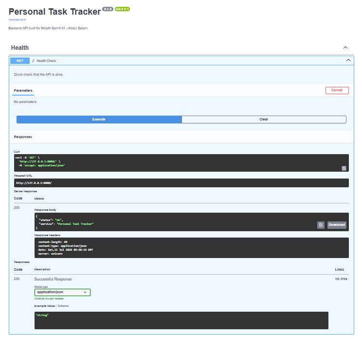

# FastAPI Testing & Documentation - Sprint 01 (Days 5-7)

This document covers the FastAPI basics implementation: routes, path/query parameters,
request/response models, Pydantic validation, status codes, and auto-generated API docs.

All endpoints were tested live using FastAPI's built-in Swagger UI (`/docs`).

---

## API Overview

**Project:** Personal Task Tracker API
**Base URL (local):** `http://127.0.0.1:8000`
**Interactive Docs:** `http://127.0.0.1:8000/docs`
**Storage:** In-memory (temporary - replaced by SQLAlchemy + persistent DB in Days 11-12)

---

## Endpoints Implemented

| Method | Endpoint | Purpose | Params Used |
|--------|----------|---------|-------------|
| GET | `/` | Health check | none |
| POST | `/tasks` | Create a new task | Request body (Pydantic model) |
| GET | `/tasks` | List all tasks, with optional filters | Query params: `is_done`, `priority` |
| GET | `/tasks/{task_id}` | Get one task by ID | Path param: `task_id` |

---

## 1. Health Check

**GET /** : confirms the API is running.



Returns a simple JSON status object with `200 OK`.

---

## 2. Create Task (POST /tasks)

Tested by creating multiple real tasks with different priorities and due dates -
not placeholder data - to validate the Pydantic model and response schema properly.

**Request body example:**
```json
{
  "title": "Complete FastAPI endpoints for Sprint 01",
  "notes": "Cover routes, validation, and status codes",
  "priority": 1,
  "due_date": "2026-07-15",
  "is_done": false
}
```

Each successful creation returns `201 Created` with the full stored task, including
its auto-assigned `task_id`.


---

## 3. Get All Tasks (GET /tasks)

Returns the full list of stored tasks. Supports optional query parameters:
- `is_done=true/false` : filter by completion status
- `priority=1/2/3` : filter by priority level

Tested with multiple tasks already created, confirming the list reflects real data
and filters apply correctly.


---

## 4. Get Single Task (GET /tasks/{task_id})

Fetches one specific task using its ID as a path parameter. Returns `404 Not Found`
with a clear error message if the ID doesn't exist - tested against a valid task ID.


---

## Validation & Status Codes Confirmed

| Scenario | Expected Result | Verified |
|----------|-----------------|----------|
| Valid task creation | `201 Created` | done |
| Fetching existing task by ID | `200 OK` | done |
| Fetching non-existent task ID | `404 Not Found` | done |
| Title shorter than 3 characters | `422 Validation Error` (Pydantic `min_length`) | done |
| Priority outside 1-3 range | `422 Validation Error` (Pydantic `ge`/`le`) | done |

---

## Notes

- Swagger UI (`/docs`) auto-generates from the FastAPI app - no manual doc writing required,
  but all schemas (`NewTask`, `TaskOut`) are explicitly defined via Pydantic for clarity.
- Server logs (visible in terminal) confirm real request/response cycles during testing -
  not just static screenshots.
- In-memory storage means data resets on server restart - persistent storage arrives
  with SQLAlchemy in Days 11-12.

---

## Server Logs (Live Testing Evidence)

Terminal output while testing endpoints via Swagger UI - confirms real request/response
cycles (status codes, methods, timestlamps) during development, not just static screenshots.


Logs show successful `GET /`, `POST /tasks` (`201 Created`), `GET /tasks` (`200 OK`),
and `GET /tasks/{task_id}` (`200 OK`) calls - matching the endpoints documented above.

---
*Part of Nolyth AI Bootcamp Sprint 01 - Days 5-7 (FastAPI Basics).*